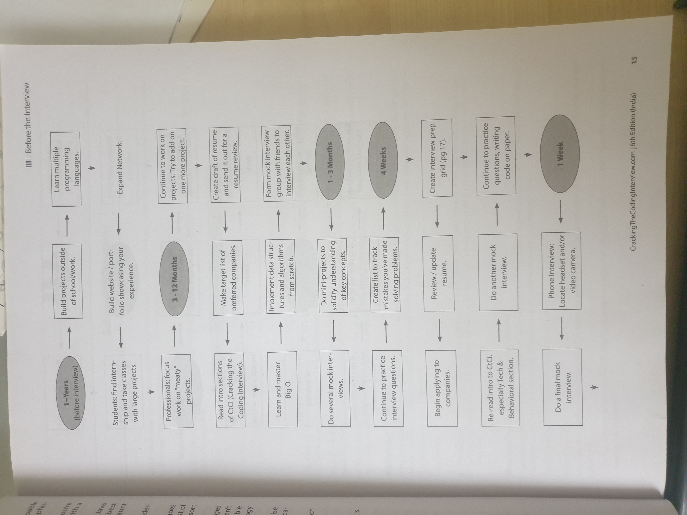
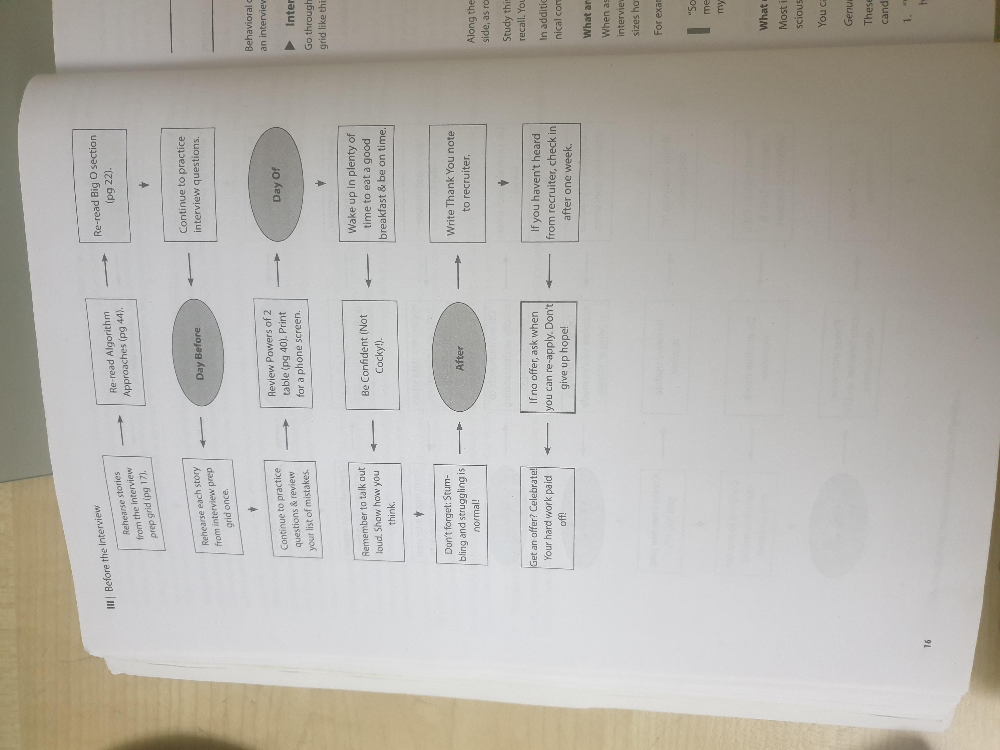

# Getting the right experience
	- without getting the great resume there is no interview. and without great experience there is no great resume. Here is what you can do to build your experience
		- Seek courses that have big coding projects. If there are no courses being part of the clubs that have this kind of an exposure we'll give a practical experience. It does not matter what it is until it gives you some experience
		- Get an internship: Do everything we can to learn an internship as early as possible. If you're not able to get an internship or do whatever time you have during holidays to build projects
		- Start something: Build a project on your own time participate in Ankiton's or contribute an open source project
- #+BEGIN_IMPORTANT
  The important thing is that you're coding digit. Not only will this develop a technical skills and practical experience your initiative will impress companies
  #+END_IMPORTANT
- 
-
- 
-
-
- # Behavioral Questions
	- Bihar questions last get to know a personality. Demi could understand your resume more deeply process there are important questions and should be prepared for
	- ##  interview preparation grid
		- Go through each of the projects or components of your resume and ensure that you can talk about them in detail.  Filling out  a grid like this may be helpful
			- Challenges faced in the project
			- Mistakes/Failures that happened in the project
			- What did you enjoy the most on the project
			- What Leadership did you take?
			- What conflicts did you face and how did you go about resolving them?
			- What you'd do differently next time?
	- ## Weakness question
		- When asked about a weakness give a real weakness! If asked how are you overcoming it provide real answers
	- ## What questions should you ask the interviewer?
		- This should be questions that you really want to know answers to. Here are a few ideas of questions that are available to many candidates
		- Asking the interviewer what brought you to this company what has been most challenging of you? Next time
		- I noticed that you use technology? how do you handle problem y?
		- I'm very interested in scalability and I would love to learn more about it. What opportunities is are there this company to learn about this?
	- ## Know your technical projects
		- As part of the preparation you should focus on two or three technical projects that you should deeply master. Select projects that ideally fit the calling criteria
			- The project had challenging components beyond just lot of learning
			- You played a key role in the project on the challenging components
			- You can talk at technical depths. For all the projects we should be able to talk about the challenges mistakes, Technical decisions, choice of technologies and the trade offs the things you would do different
	- ## Responding to Behavioral questions
		- Be specific and not arrogant
		- Focus on yourself and your contributions and not the team
		- Give structured answers
			- A good format to follow is the S.A.R (Situation , Action , Results): Describe the situation, Describe the action that you took and the results due to those actions and how the situation changed
			- Ex: Tell me about a challenging interaction with a teammate.
		- By using the S.A.R model with clear situations, actions and results, the interviewer will be able to easily identify how you made an impact and why it mattered
	- ## Tell me about yourself question
		- Many interviewers kick off the session by asking you to tell them a bit about yourself, or asking you to walk through your resume. This is essentially a "pitch". It's your interviewers first impression of you, so you want to be sure to nail this.
-
	-