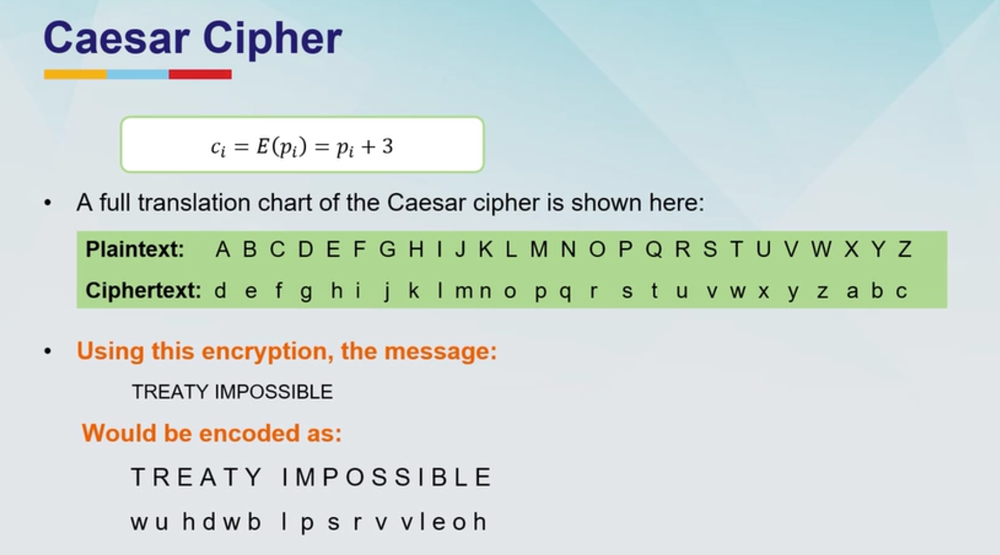
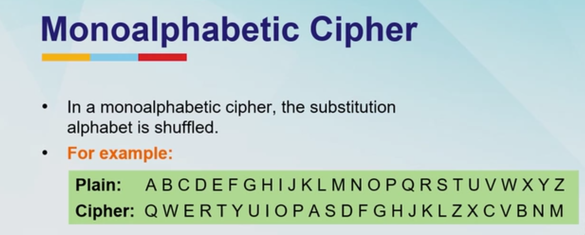

- What is the substitution method? #card
  id:: 6a7da7a9-b316-4311-b48d-d41048f43726
	- The methods encypt plain text by replacing its elements with other characters, symbols or numbers
	- Replace one or more characters with other characters
- # Types of substitution method
	- List some of the substitution methods available? #card
	  id:: 6a84860d-a348-4095-af2f-b6fd439f0a01
		- Caesar cipher
		- Monoaphabetic cipher
		- Playfair cipher
		- Hill Cipher
		- Polyalphabetic cipher
		- one-time pad
		- Homophonic cipher
		- Polygram cipher
- What are the strengths and weakness of the substitution cipher method? #card
  id:: 6a848634-d354-457d-8810-151567d90d72
	- Strenghts:
		- Simple to implement
		- Good for educational purposes and historical understanding
	- Weakness
		- Vulnerable to frequency analysis
		- Easily broken with modern computational tools unless enhanced (e.g polyalphabetic or one-time pad)
		- They are vulnerable to frequency analysis and brute force attacks
		- Overall foundation but insufficient for modern cryptographical needs
		-
- # Caesar cipher
	- What is Caesar Cipher? How does it work? #card
	  id:: 6a84868a-1470-4fe4-beca-a54be7fa3b92
		- Earliest known substitution cipher
		- Used by Julius caesar for use in military communication
		- Shifts each latter by a fixed number of positions
		- 
	- What is the critical weakness of the Caesar Cipher method? #card
	  id:: 6a8486ad-5ffe-4d14-856b-e8ece5d9ec23
		- Since there are only 25 possibilities breaking the key with brute force attack is trivial. Also the frequency analysis of the encrypted text can easily lead to the key
		- Not used in modern cryptograph today. Its very basic and used in puzzles and educational tools
- # Monoalphabetic cipher
	- What is monoalphateic cipher? How does it work? #card
	  id:: 6a848772-a9a5-4a76-8a1e-4cff0b428d1f
		- The substitution alphabet is shuffled.
		- An entirely random set it choosen and the alphabets are shuffled.
		- 
		- This method is used in puzzles and games
- # Playfair Cipher
	- This uses diagraphs. What are digraphs?
		- n Linguistics (Phonics & Writing)
		- In language study, a digraph is completely different. It is a **combination of two successive letters that represent a single, distinct sound** (phoneme). [[1](https://www.thoughtco.com/digraph-sounds-and-letters-1690453), [2](https://en.wikipedia.org/wiki/Digraph), [3](https://www.planetspark.in/spoken-english/digraph-words-made-simple-for-kids), [4](https://www.ashwell.herts.sch.uk/attachments/download.asp?file=469&type=pdf)]
		- Common Examples in English:
			- **"sh"** in _shoe_
			- **"ch"** in _chair_
			- **"th"** in _the_
			- **"ph"** in _phone_
		- In these cases, you do not pronounce the two letters separately; they fuse together to create a brand-new phonetic sound
	- What is playfair cipher? What are the steps for encipherment? #card
	  id:: 6a8487b4-7bd0-4e9b-8503-92c794475272
		- Steps for playfair text
			- Prepare a matrix 5x5 with I/J combined into one. This is possible since english has only 26 alphabets. Not sure on how other languages are encoded. This is derived from a keyword.
			- It begins with the creation of a 5×5 grid populated by a keyword, omitting duplicate letters and typically merging ‘I’ and ‘J’ into a single cell. The remaining letters of the alphabet are then filled in, ensuring each appears only once.
			- After this the plain text is prepared. If the same alphabets are repeating then insert an X in between them. If needed an odd letter is added at the end (this part is not very clear)
			- Then the plain text is encoded using the matrix and the following rules
				- Take a pair of and for each pair apply the rule below
					- if both the characters are in the Same row: Replace each letter with the one to its right (loop back if needed)
					- If both the characters are in the same column: Replace each with the letter below it
					- If the characters form a Rectangle, replace each letter with the one in its row but the other's column
		- This method is obsolete by the current standards
	-