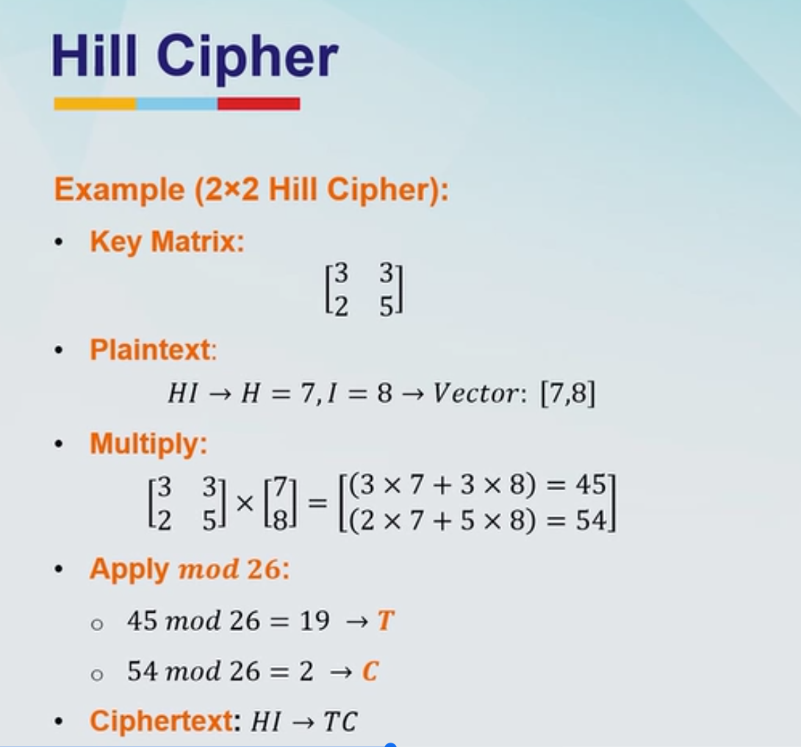

# Hill Cipher
	- Uses linear algebra
	- Choose a key matrix (usually 2 x 2 or 3x3) and convert the plaintext into vectors using the numerical equivalents (A = 0 , B = 1 , ...Z = 25)
	- Multiple the key matrix by each plaintext vector (mod 26) to get the ciphertext
	- For decryption use the inverse of the key matrix mod 26
	- 
	- Not used widely today
	-
- # Polyalphabetic cipher
	- Uses multiple alphabets for encoding
	- Instead of replacing with a single alphabet these ciphers use a set of replacement alphabets and cycle through them
	- ## Vigenere Cipher
		- Choose a keyword: Let's use the keyword : KEY
		- Encrypt a message: Plaintext: hello
		- Repeat keyword to match text length: The keyword is repeated until it matches the length of the plain text
		- Encryption algorithm:
			- Align each plaintext letter with a keyword letter
			- Convert both to numerical values (A = - , B = 1 ...Z = 25)
			- Add the values together, mod 26
			- Convert result back to letters
	- ## One-time pad
		- Provides unbreakable encryption when used correctly
		- A random key equal to the length of the plain text
	-