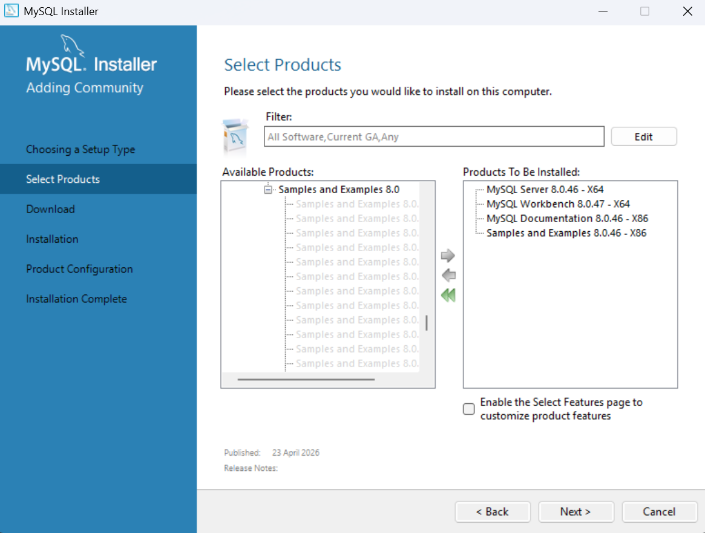
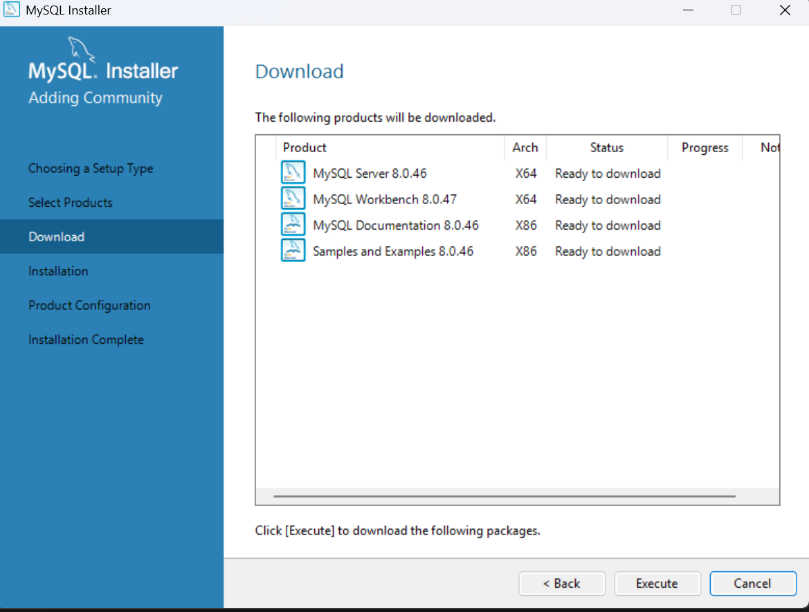
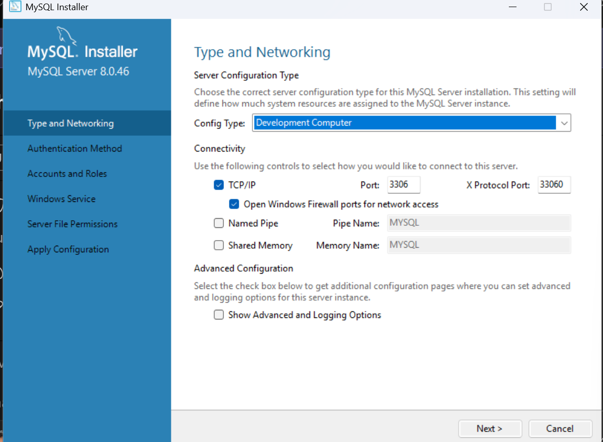

- We will install the community edition which is free for Windows operating system
- Download the ysql-installer-web-community-*.msi from the page https://dev.mysql.com/downloads/installer/
- No need to create Oracle web account, just click on this button "No thanks, just start my download"
- Use custom install and install the below components only
- 
- 
- 
- root password: dbmslearning@1234
- Add user - bhala/dbmscourse@1234
-