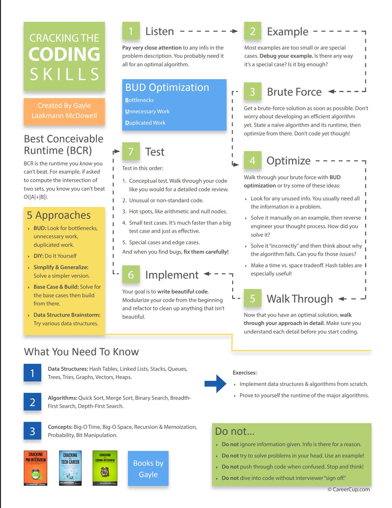

# How to prepare
	- Do not just read through problems and solutions. You need to practise
	- #+BEGIN_IMPORTANT
	  Try to solve a problem on you own
	  #+END_IMPORTANT
	- #+BEGIN_IMPORTANT
	  Write code on paper. Coding on computer provides help such as syntax highlighting , code completion etc. Coding on paper make you focus on the logic
	  #+END_IMPORTANT
	- #+BEGIN_IMPORTANT
	  Alternatively you can writhe algorithm or steps in simple english or using pseudocode or python syntax even if you are going to program in a different language. This helps to clarify the logic
	  #+END_IMPORTANT
	- #+BEGIN_IMPORTANT
	  Test your code. Write down the general cases , base cases , error cases and so on. You will need to do this during the interview, so its best to practise this in advance
	  #+END_IMPORTANT
	- #+BEGIN_IMPORTANT
	  Type your code in a computer. Keep noting down the mistakes. Start a list of all the errors you make so that you can keep these in mind during the interviews
	  #+END_IMPORTANT
- # What you need to know - at the minimum
	- |Datastructure|Algorithms|Concepts|
	  |--|--|--|
	  |Linked Lists|Breadth-first search|Bit manipulation|
	  |Trees, Ties and Graphs|Depth-first search|Memory (stack vs Heap)|
	  |Stacks and Queues|Binary Search|Recursion|
	  |Heaps|Merge Sort|Dynamic programming|
	  |Vector/ ArrayLists|Quick Sort|Big O Time and Space|
	  |Hash Tables|||
	  ||||
	- For each of these topics, make sure you understand how to use and implement them, and, where applicable, the space and time complexity.
	- Practise implementing the DS and Algo on paper and then in computer. It will help you to learn the internals of how the DS work, which is important for many interviews
	- #+BEGIN_TIP
	  In particular hash tables are an extremely important topic. Make sure you are comfortable with this
	  #+END_TIP
	- # Powers of 2
		- Below table is useful for many questions involving scalability or any soert of memory limitation
		- |Power of 2|Exact value (X)|Approx value|X Bytes into MB , GB etc|
		  |--|--|--|--|
		  |7|128|||
		  |8|256|||
		  |10|1024|1 thousand|1 KB|
		  |16|65,356||64 KB|
		  |20|1048576|1 nillion|1 MB|
		  |30|1,073,741,824|1 billion|1 GB|
		  |32|4,294,967,296||4 GB|
		  |40|1,099,511,627,776|1 trillion|1 TB|
- # Walking through the problem
	- 
- # What to expect
	- #+BEGIN_IMPORTANT
	  Interviews are supposed to be difficult. If you don't get every - or any - answer immediately, that's okay. That's the normal experience, and its not bad !!!
	  #+END_IMPORTANT
- # Listen carefully
	- Listen carefully and notice/notedown anything unique in the problem statement
	- Ex : If the problem say data is sorted, then the algo for sorted data might be different for the non-sorted data. If you are struggling for optimizing the solution then may be you have missed some key data
- # Draw an example
	- Do not create a simple example or special case.
	- ## Example should be
		- Specific : It should use real numbers or string (if applicable to the problem)
		- Sufficiently large. Most examples are too small
		- Not a special case.
- # state a brute force
	- Once you have an example state the brute force and state the space an time complexity.
	- Interviewers will know that you have understood the problem
	- Then optimize the solution
- # Optimize
	- Once you have a brute force algo, try to optimize it. A few techniques that work well are
	-
	-