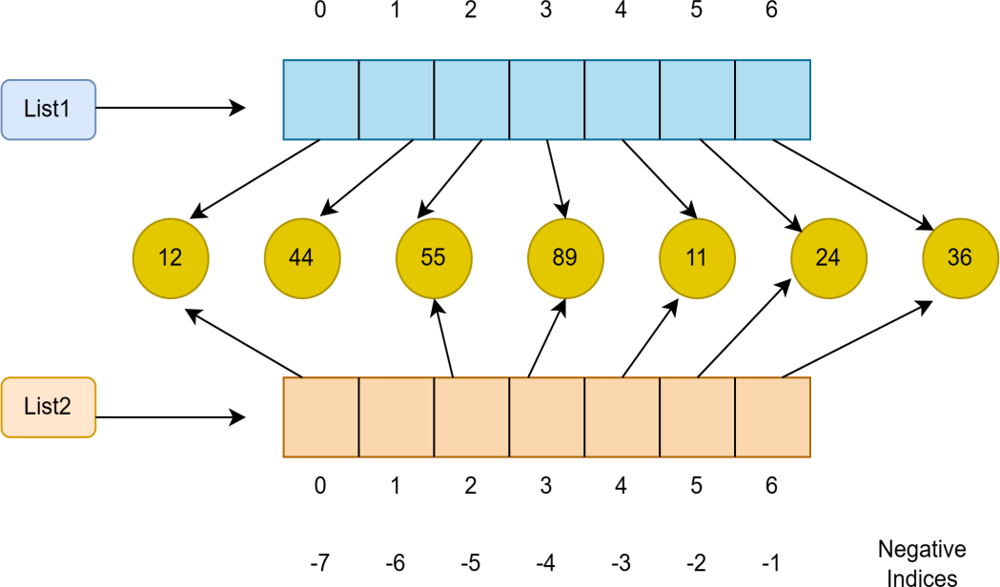

# List characteristics
	- Elements in the list can be heterogeneous (different datatypes) or homogeneous
	- Elements are accessed using indexing operation (also called subscript notation).
	- Lists are mutable, as it can grow and shrink
	- List is iterable - is eager and not lazy.
	- Assignment of one list to another causes both to refer to the same list.
	- List can be sliced. This creates a new (sub)list.
	- ```python
	  >>> numbers=[55,88,45,12]
	  >>> numbers[0]=10 # index operation is used.
	  >>> numbers
	  [10, 88, 45, 12]
	  ```
- List is iterable - is eager and not lazy.
  Ex: (i) 
  ```python
  numbers=[55,88,45,12]
  for i in numbers:
  print(i, end =' ')
  ```
- ```python
  number=[10,20,30,40,50]
  i=0
  while(i<len(number)):
  	print(number[i],end=' ')
      i=i+1
  ```
- List can be nested. We can have list of lists.
  ```python
   numbers=[55,20,[63,72,33]]
  for i in numbers:
  print(i, end =' ')
  ```
- 
- list can be sliced
- ```python
  lst = [10,20,30,40,50]
  # l[start:end] # the end is not included
  lst[1:3]
  # just using the : gives the enntire list
  lst[:]
  # skipping the start means from beginning
  lst[:3]
  # skipping the end means include till the end
  lst[2:]
  
  ```
- # Creation of list
	- List items are surrounded by square brackets and the elements in the list are separated by commas
	- A list can be empty.
		- ```python
		  lst = []
		  lst = list()
		  ```
- # Builtin functions
	- |function| when to use it| example|
	  |len(list_name)|to get the number of elements in the list| len(lst)
	  |max(list_name)|to get the max of them elements in the list|max(lst)|
	  |min(list_name)|to get the minimum of elements in the list|min(lst)|
	  |sum(list_name)|to get the sum of elements in the list| sum(lst)|
	  | + (concatenation operator)| We can create a new list by adding two existing lists together.|lstnew = l1 + l2|
	  | * (repetition operator) | Allows for the multiplying of the list n times and create a new list| lstnew = lst*2|
	  |lst.sort| to sort the elements in the list | lst.sort()|
	  |lst.append()| Append elements to the end of the list||
	  |lst.insert(pos,val)| insert val at a specific postion||
	  |lst.extend()|adds the specified list elements (or any iterable) to theend of the current list. | lst.extend([20,25,30]|
	  |lst.pop(index) | remove and return at the value at the index. If no index is specified last element is returned and removed|
	  |lst.count(val)| Returns the number of occurances of value in a list||
	  |lst.index(val)| Returns first index of a value. Raises ValueError is the value is not present||
- # membership
	- in and not in : in returns true if an item exists in the list. Otherwise false
	- not in is the opposite
- # Comparison
	- We may at times need to compare data items in the two lists to perform certain operations by using == operator.
	- ```python
	  >>> list1 = [10,2.2,(22,33,43]
	  >>> list2=[2,3,4]
	  >>> list1==list2
	  False
	  >>>list1!=list2
	  True
	  ```
- # List using the for loop
	- The for loop in Python is used to iterate over a sequence (list, tuple, string) or other iterable objects.
	- Iterating over a sequence is called traversal.
	- Loop continues until we reach the last item in the sequence
	- The body of for loop is separated from the rest of the code using indentation.
	- ```python
	  for val in lst:
	    print(val)
	  ```
-
- Exercise: How to use the list as a stack? Which methods are use for doing this? #card
	- The end of the list can be used as the top of the stack
	- lst.append() method for adding a value to the end of the list. In this case the top of the stack
	- lst.pop() - without the index will pop at the end of the list. In this case the top of the stack
	-
	-