- An operator is a symbol that represents an operation that may be performed on one
  or more operands.
- An operand is a value that a given operator is applied to.
- An expression is a combination of symbols that evaluates to a value.
- Expressions, most commonly, consist of a combination of operators and operands
  4 + (3 * k)
- It can also consist of a single literal or variable. Thus, 4, 3, and k are each expressions
- Expressions that evaluate to a numeric type are called arithmetic expressions
-
- # Categories of Operators
- 1. Based on the type of Operation
	- Arithmetic Operators - ( + , - , * , / , // , % , **)
	- Relational Operators - ( == , != , < , <= , > , >= )
	- Membership Operators - (in , not in
	- Boolean (Logical) Operators - and , or and not
	- Bitwise operators ( & , | , ^ , >> , << , ~ )
	- Identity Operators ( is , is not )
	- Assignment operators and shorthand operators - ( += , -=, *= , /= , //= , %= , **= )
- Based on number of operands
	- Unary
	- Binart
	- Ternary
-
- # Arithmetic operators
	- 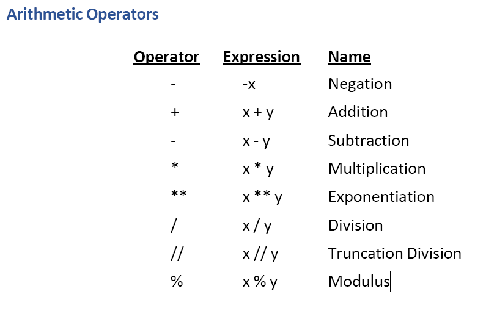
	- # Division Operator
		- Python provides two forms of division:
		  • “True” division is denoted by a single slash, /
		  Thus, 25 / 10 evaluates to 2.5
		  • “Truncating" division is denoted by a double slash, //
		  Thus, 25 // 10 evaluates to 2
	- Truncating division provides a truncated result based on the type of operands applied to
	  • When both operands are integer values, the result is a truncated integer referred
	  to as integer division.
	  • When as least one of the operands is a float type, the result is a truncated
	  floating point.
	  Example:
	  ```
	  >>> 5//2
	  2>
	  >> 5//2.0
	  2.0
	  ```
	- 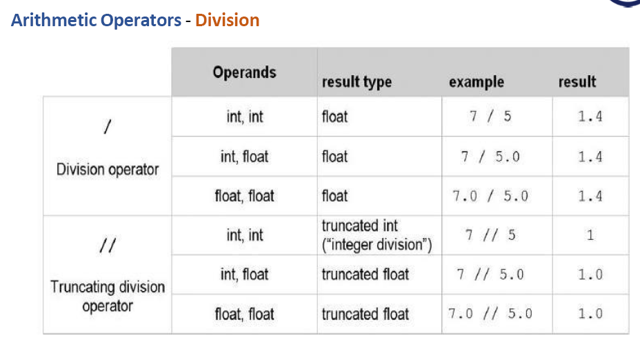
	- 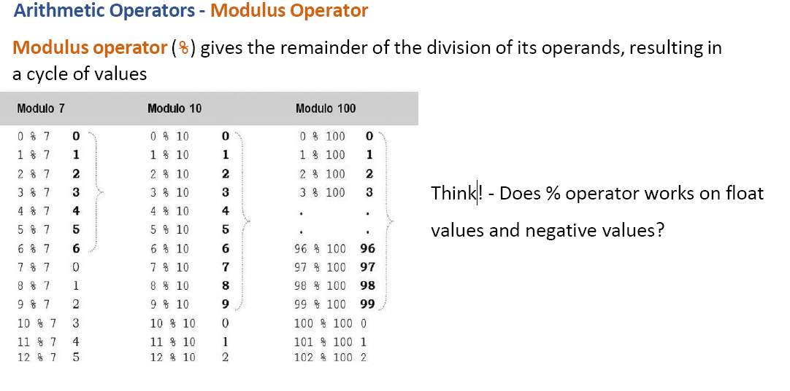
	-
- # Exercise
	- Try the % operator on floating value and negative values and write the result
	-
- # Relational Operator
	- 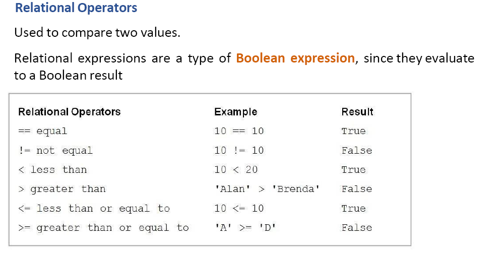
	-
	- 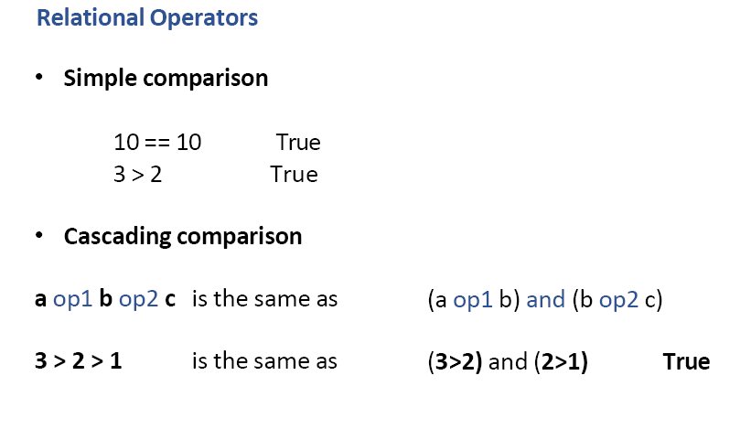
	- 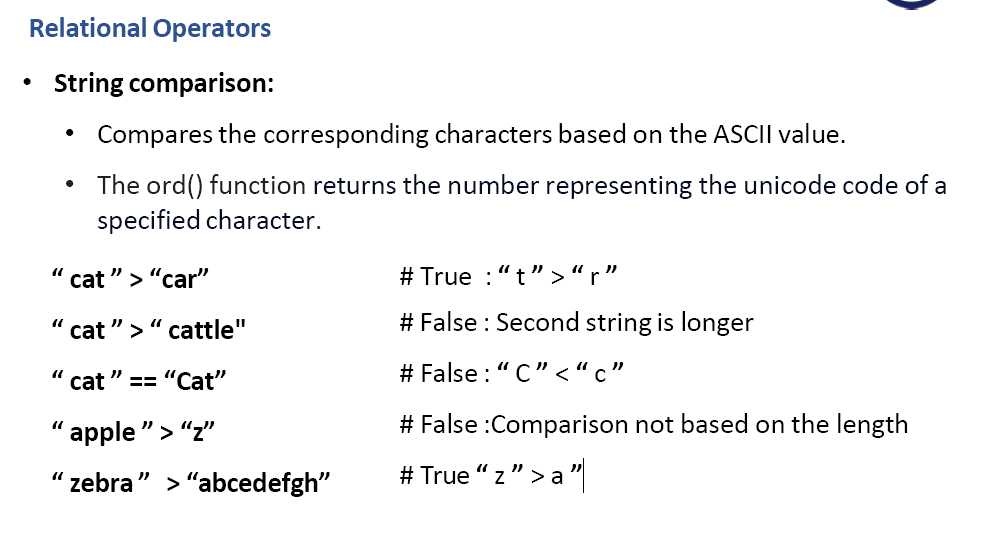
	- 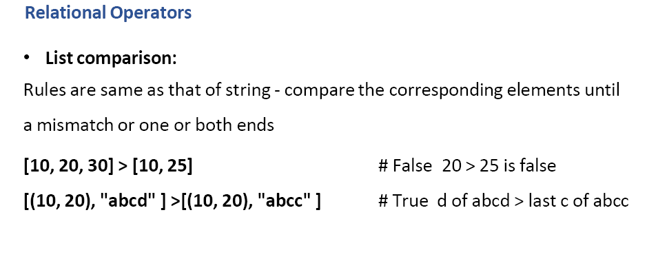
	- 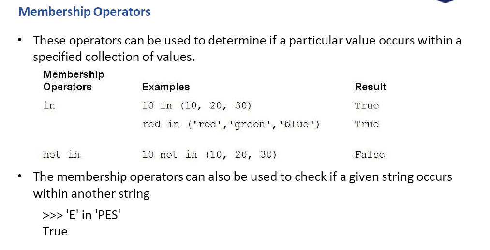
	- 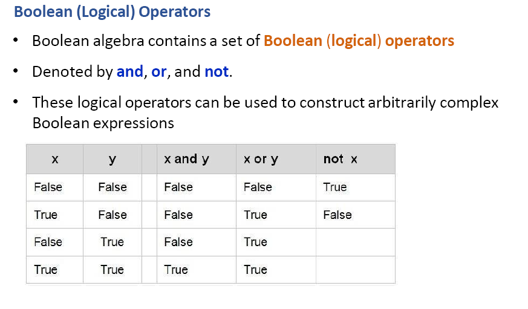
	- 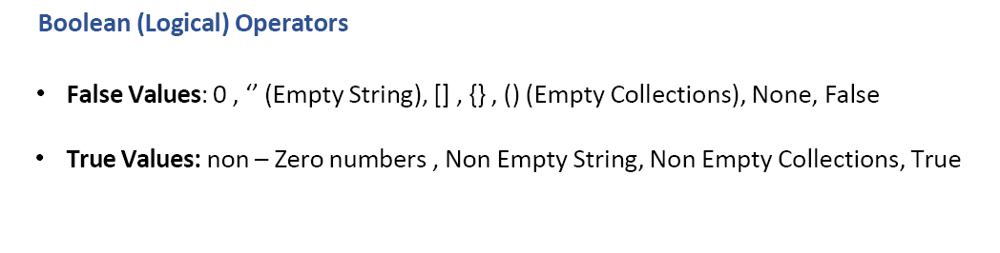
	- 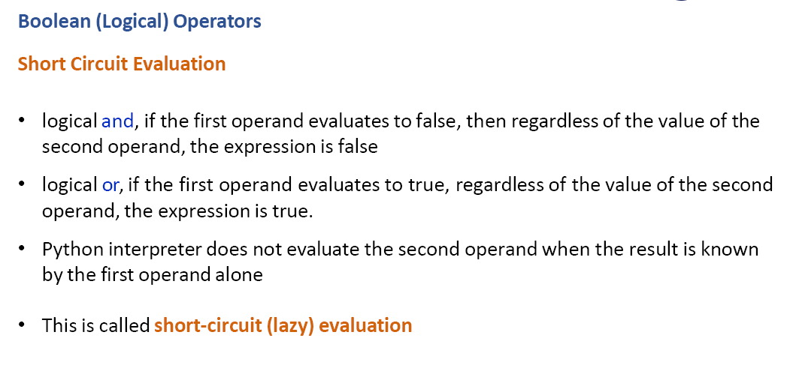
	- 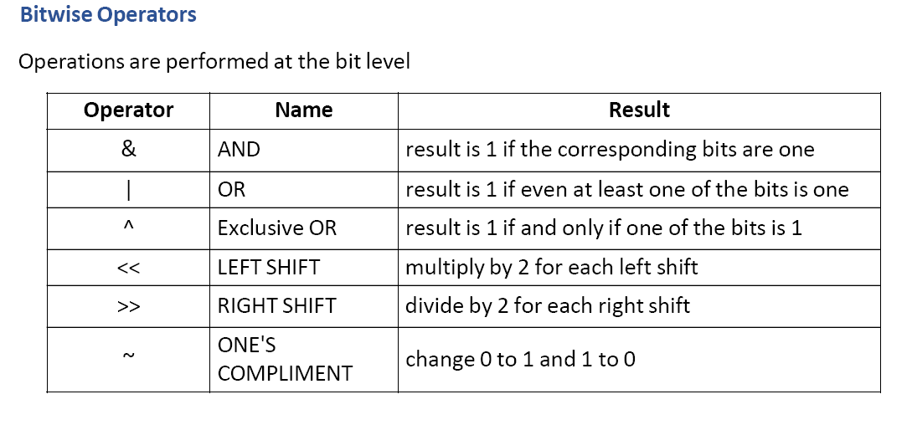
	- 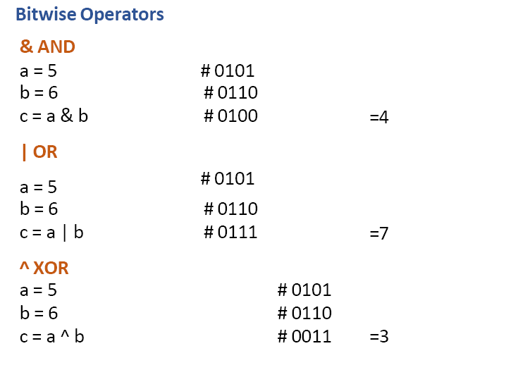
	- 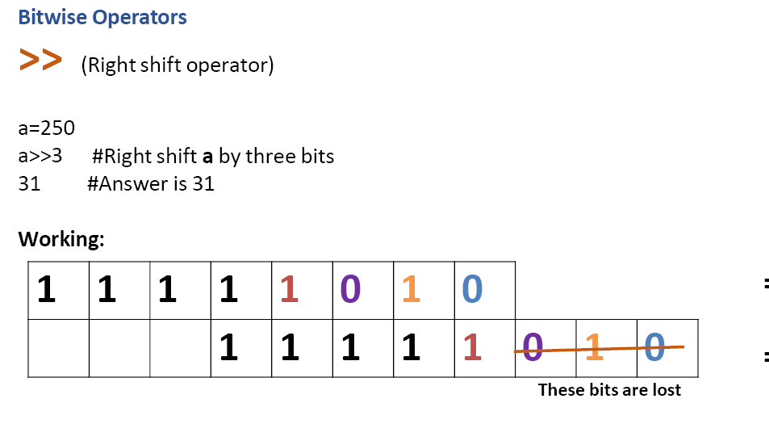
	- 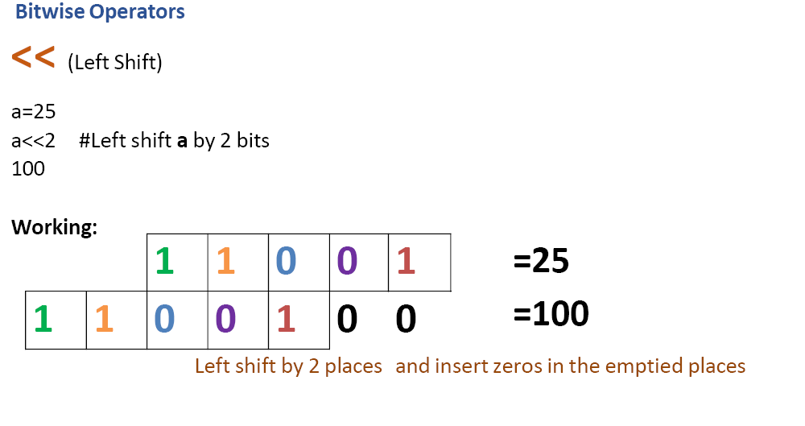
	- 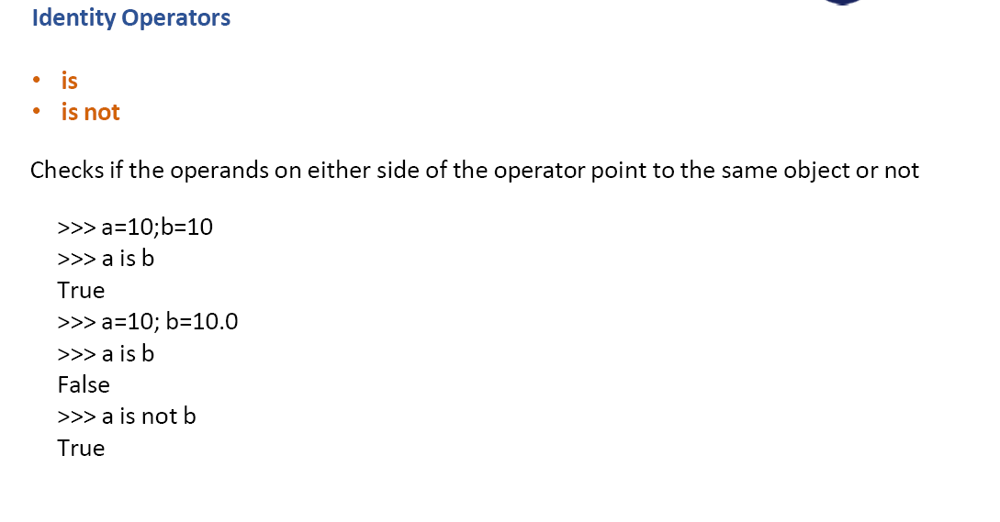
	- 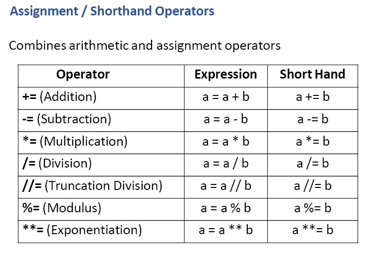
	- {:height 566, :width 822}
	-
-
-