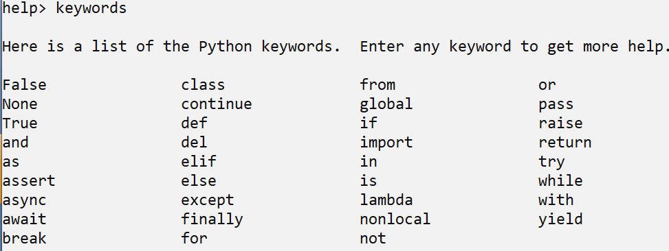

- What are python keywords?
	- Keywords are reserved words that have a predefined meaning. To know the keywords, type help() in the python prompt and in the help prompt,
	  type keywords
	- 
	-
- What is a variable in python? #card
  id:: 6a728bc3-5ad5-4d64-881f-e843d672215f
	- A variable is a name (identifier) that is associated with a value and it is always reference type
	- Variables are assigned values by use of the assignment operator , =
- When is a variable created in python? Does it need to be declared first? #card
  id:: 6a728c15-c90b-4873-9583-4aa912138273
	- A variable is created when a value is assigned to it. Python being a dynamic programming language does not need the variable to declared being assigned a value. The creation of the variable and assigning a value happens at the same time
	- This applies even for Object Oriented features of python
- How is the memory allocated to a value managed in python?
	- This is done by garbage collector. A count of references for each value is maintained. When the count of the references referring to a value become zero the memory is garbage collected
	- In other words: If no other variable references the memory location of the original value, the memory location is deallocated (that is, it is made available for reuse).
-
- # Exercise
	- In the code below what will be the value of K at the end and why?
		- ```python
		  num = 10
		  k = num
		  num = 20
		  ```
- # id() , datatypes and type() function
	- This built-in function that returns the identity of an object. Commonly used to check if two variables or objects refer to the same memory location.
	- The is keyword is used to test whether two variables belong to the same object. The test will return True if the two objects are the same else it will return False.
	- ```python
	  >>> num=10
	  >>> k=10
	  >>> id(num)
	  2863970058768
	  >>> id(k)
	  2863970058768
	  >>> numis k
	  True
	  ```
- What are datatypes and why are they important? #card
  id:: 6a728e0f-682a-4539-a150-fb9922cad46b
	- Datatype refers to the type of value a variable refers to.
	- Significance of data type:
		- Memory associated with it
		- Operations that can • be performed on it.
		- Range of values allowed in it
		- Some example Types:
		  • Scalar - Integers, floats, boolean, complex
		  • Reference - List, tuple, set, dict
- What is the type() function?
	- Returns the type of the object.
	- Type of a variable depends on the value assigned to it
	- ```python
	  a = 10
	  print(type(a)) #int
	  a = 10.0
	  print(type(a)) # float
	  ```