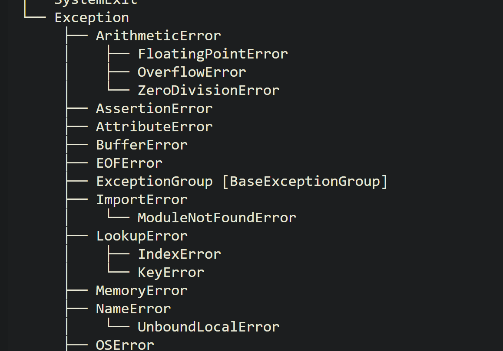

- What will happen when an unhandled expection occurs? #card #python-exception
  id:: 6a8ae1d2-1912-45bc-9686-82ab40a4574d
	- The program terminates
- What is an exception? #card #python-exception
  id:: 6a8ae280-f219-4e26-a3f7-8dabd8bdbd3e
	- It is special events that happen when something out of the ordinary occurs
	- Python has an object called exception
- What does raising an exception mean ?#card #python-exception
  id:: 6a8ae2c2-839e-493c-a857-ce739d5a4361
	- raising an exception means that we are starting an exception event flow
- Python Exception (and in Java and C++) also form an hierarchy? Explain #card #python-exception
  id:: 6a8ae2ff-b439-4bee-ac27-da3faeb1e1b8
	- Python Exception objects  for a hierarchy of Exception type with more specific types inheriting from the more broader types
	- Ex: LookupError is a more broader exception type. IndexError and KeyError are more specific types of the LookupError type.
	- While handling exceptions you can handle more broader type or handle more specific types. If the LookupError is handled then both the IndexError and the KeyError are handled
	- The documentation can be found at https://docs.python.org/3/library/exceptions.html#exception-hierarchy
	- {:height 365, :width 569}
- Name some commonly encountered exception? #card #python-exception
  id:: 6a8ae463-8f08-44dd-93aa-10d4600ffed0
	- Syntax Error
	- ZeroDivisionError
	- IndexError
	- KeyERror
	- ValueError
	- TypeError
	- FileNotFoundError
	- The list of the exception can be found in the documentation at
- How to raise an Exception ? #card #python-exception
  id:: 6a8ae77f-127e-40a3-93e8-4942230ac447
	- Step1: Create a new exception object
	- Step2: Raise the exception
	- the example below shows how to create an raise a builtin exception
	- ```python
	  ex = ValueError('Name must be at least 5 characters long.')
	  raise ex
	  ```
	- `raise <exception object>` raises the exception and starts an exception handling flows
	- raising an exception ourselves results in the same exception flow that happens when python creates the exception
- How to check if one exception type is a subclass of the other? #card #python-exception
  id:: 6a8ae8f2-ae46-42f1-b15d-b8f276550a53
	- For this you can use the issubclass(type1,type2) or the issuperclass(type1, type2) functions from the python object oriented programming
	- ```python
	  issubclass(KeyError, LookupError) #returns Trues
	  issubclass(KeyError, Exception) # Exception is one of the top most classes from which many class inherit
	  ```
- How to handle the exception using the try/except block? #card #python-exception
  id:: 6a8aebd3-8623-4081-bf95-51358e09f478
	- ```python
	  try: 
	    #code 
	  except <exception_type1> as ex:
	    #code
	  except <exception_type2> as ex:
	    #coce
	  ```
	- In the code above the ex is the exception object.
- What will the below code do? 
  id:: 6a8aed97-05c3-4f65-876b-871d8d773ad6
  ```python
  try:
    a = 10
    b = 0
    c = a/ b
  except ZeroDivisionError as ex:
    print("Division by Zero occurred")
    raise
  ```
  #card #python-exception
	- this will raise the exception again. Since the exception type is not specified it will re raise the original exception that resulted in that block of code being executed
	- You an also specify a different exception along with the raise if needed
- How to provide a generic error handler that handles most of the exception? #card #python-exception
  id:: 6a8aeefb-c7b8-42e1-a01a-c6549af9dbfa
	- If the except block contains a specific Exception type but the actual exception raises is not handled; the program terminates
	- To provide a generic handler you can use the Exception type which is a super type of most of the runtime exceptions
	- ```python
	  try:
	    #code
	  except Exception as ex:
	    print(ex)
	    send_email("Error occured")
	  
	  ```
- How to handle mutliple exception type? #card #python-exception
  id:: 6a8aef7e-759b-4542-99b6-ec65ac7ed538
	- ```python
	  try:
	    #code
	  except IndexError as ex:
	    #code
	  except ValueError as ex:
	    #code
	  except Exception as ex:
	    #code
	  ```
	- Python tries to match the exception raise in the order in which the code is written and uses the first match to execute the block
	- Hence the code should first have the most specific error and then followed by least specific error as per the Exception Class hierarchy
- What is the finally clause in exception handling? #card #python-exception
  id:: 6a8af0a4-c557-4a9f-b9b2-0a3cacfa4df0
	- Sometimes we want some code to run after a try..except..whether an exception occurred or not, and whether it was handled or not.
	- The finally clause is typically used to free up any resources such as closing a file or a database connection etc
	- ```python
	  try:
	    #code
	  except ValueError as ex:
	    #code
	  except Exception as ex:
	    #code
	  finally:
	    # always runs no matter what
	  ```
- What will be the output of this block ? 
  id:: 6a8af139-e5b1-49ba-84a8-24b461cefcb8
  ```python
  try:
    1/0
  except ZeroDivisionError as ex:
    print(f"Exception occured {ex} , {type(ex)})
  print("code continues running here")
  ```
  #card
	- print the out of the line 4 and the program continues and prints on line 5
-