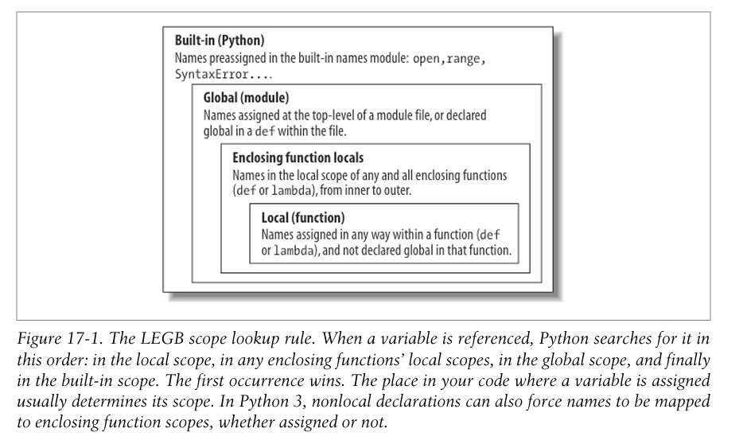

- What is the purpose of the def statement? #card
  id:: 6a83a03a-e2b0-42e6-a098-75752d1cd71b
	- The def statement is an executable statement and is used to create a function
- Is this code valid?
  id:: 6a83a05f-9cce-42f2-8e4d-327287de195c
  ```python
  x = 20
  if x > 10 and x > 25:
    def fun1(y):
      return y + 1
  else:
    def fun1(y):
      return y + 100
      
  # now that the function is defined; call it
  fun1(1000)
  ```
  #card
	- Yes, its valid. As def is an executable statement it can used like any other expression. This is not possible in compiled languaged
- What does the python interpreter do when it executes a def statement? #card
  id:: 6a83a0b3-8ac8-4d20-b967-0f22c3c0dd57
	- When a def statement is executed a function object is created and assigned to variable with the function name. Just like any other variables we can have as many variables point to that object as needed. Try the below code and see
	- ```python
	  def fun1():
	    print("This is fun1")
	    
	  print(type(fun1))
	  ```
	- Note the output of the print statement. It is an object of <class 'function'>
- What is the objective of using the global keyword while assigning values to variables in functions? #card
  id:: 6a83a20f-7616-4307-8b1e-5399c0ce32c1
	- Typically the variables declared are local to the function scope. However the function has access to the variables that are define in the enclosing scope.
	- Since in Python a variable is created when it is assigned a value, by default, if the variable name is matching with another variable in the enclosing scope, the variable of the enclosing scope gets masked
	- In the example below the x in the enclosing scope get masked with the variable in the local scope
	- ```python
	  x = 20
	  def fun1():
	    x = 150 #local variable
	    print("x is ",x)
	  print(x) # from the enclosing scope
	  fun1() # prints the local x
	  
	  ```
	- To overcome this issue and to assign a value of 200 to the x in the enclosing scope the global keyword must be used. To used the global x, it should mentioned as global before assignment of the value
	- ```python
	  def fun2():
	      global x
	      x = 1000
	      print("x is", x)
	  ```
- How are arguments passed in python? #card
  id:: 6a83a403-be3a-4e4a-9cbc-86a9732b3979
	- By reference
- What is meant by the function polymorphism in the context of python? #card
  id:: 6a83a561-07b5-4d5c-b896-8a456d0701df
	- It means that the same function can produce different outputs depending on the type of the object passed to the function
	- ```python
	  def times(x ,y):
	    return x * y
	  
	  times(10, 2) # produces 20
	  times("hi" , 2) # produces hihi
	  ```
	- Since the * operator is defined for both integers and strings, the same function works fine and produces different outputs
- # Python Scopes
	- Explain the different levels of scope for variable declarations in the function? #card
	  id:: 6a83d118-a7aa-4fd0-a5ce-cfd24d220fe8
		- If a variable is assigned inside a def, it is local to that function.
		- If a variable is assigned in an enclosing def, it is nonlocal to nested functions.
		- If a variable is assigned outside all defs, it is global to the entire file. We call this lexical scoping because variable scopes are determined entirely by the lo cations of the variables in the source code of your program files, not by function calls
	- Explain what the term global scope mean? #card
	  id:: 6a83d191-094f-443b-afa4-012a0ec3986f
		- The enclosing module is a global scope. Each module is a global scope—that is, a namespace in which variables created (assigned) at the top level of the module file live. Global variables become attributes of a module object to the outside world but can be used as simple variables within a module file.
		- The global scope spans a single file only. Don’t be fooled by the word “global” here—names at the top level of a file are only global to code within that single file. There is really no notion of a single, all-encompassing global file-based scope in Python. Instead, names are partitioned into modules, and you must always import a module explicitly if you want to be able to use the names its file defines. When you hear “global” in Python, think “module.”
	- Represent the different scopes in python and how a variable is searched in different scope? #card
	  id:: 6a83d279-2fdc-4f5e-91f1-bb94ccbe1aa6
		- LEGB rule - Local , Enclosing , Global and then Builtin
		- 
	- What are python builtins? #card
	  id:: 6a83d573-1b35-478d-bcfd-932875a2daf1
		- It is the functionality provided by the Python itself. It is implemented as a module called `builtins`. To see the objects available in the builtins, you need to import it and then run the dir function
		- ```python
		  import builtins
		  dir(builtins)
		  ['ArithmeticError', 'AssertionError', 'AttributeError', 'BaseException', 'BaseExceptionGroup', 'BlockingIOError', 'BrokenPipeError', 'BufferError', 'BytesWarning', 'ChildProcessError', 'ConnectionAbortedError', 'ConnectionError', 'ConnectionRefusedError', 'ConnectionResetError', 'DeprecationWarning', 'EOFError', 'Ellipsis', 'EncodingWarning', 'EnvironmentError', 'Exception', 'ExceptionGroup', 'False', 'FileExistsError', 'FileNotFoundError', 'FloatingPointError', 'FutureWarning', 'GeneratorExit', 'IOError', 'ImportError', 'ImportWarning', 'IndentationError', 'IndexError', 'InterruptedError', 'IsADirectoryError', 'KeyError', 'KeyboardInterrupt', 'LookupError', 'MemoryError', 'ModuleNotFoundError', 'NameError', 'None', 'NotADirectoryError', 'NotImplemented', 'NotImplementedError', 'OSError', 'OverflowError', 'PendingDeprecationWarning', 'PermissionError', 'ProcessLookupError', 'RecursionError', 'ReferenceError', 'ResourceWarning', 'RuntimeError', 'RuntimeWarning', 'StopAsyncIteration', 'StopIteration', 'SyntaxError', 'SyntaxWarning', 'SystemError', 'SystemExit', 'TabError', 'TimeoutError', 'True', 'TypeError', 'UnboundLocalError', 'UnicodeDecodeError', 'UnicodeEncodeError', 'UnicodeError', 'UnicodeTranslateError', 'UnicodeWarning', 'UserWarning', 'ValueError', 'Warning', 'WindowsError', 'ZeroDivisionError', '_', '__build_class__', '__debug__', '__doc__', '__import__', '__loader__', '__name__', '__package__', '__spec__', 'abs', 'aiter', 'all', 'anext', 'any', 'ascii', 'bin', 'bool', 'breakpoint', 'bytearray', 'bytes', 'callable', 'chr', 'classmethod', 'compile', 'complex', 'copyright', 'credits', 'delattr', 'dict', 'dir', 'divmod', 'enumerate', 'eval', 'exec', 'exit', 'filter', 'float', 'format', 'frozenset', 'getattr', 'globals', 'hasattr', 'hash', 'help', 'hex', 'id', 'input', 'int', 'isinstance', 'issubclass', 'iter', 'len', 'license', 'list', 'locals', 'map', 'max', 'memoryview', 'min', 'next', 'object', 'oct', 'open', 'ord', 'pow', 'print', 'property', 'quit', 'range', 'repr', 'reversed', 'round', 'set', 'setattr', 'slice', 'sorted', 'staticmethod', 'str', 'sum', 'super', 'tuple', 'type', 'vars', 'zip']
		  ```
		- You can notice all the exceptions in the beginning and then the collections like the the dict, True, False etc
		- Since the builtins module is imported by default all of these are available for the programs
	- What are global variables and how to use them in python functions? #card
	  id:: 6a843b66-8089-413e-9254-c333e7ee85c6
		- Global names are variables assigned at the top level of the enclosing module file.
		- Global names must be declared only if they are assigned within a function.
		- Global names may be referenced within a function without being declared. In other words, global allows us to change names that live outside a def at the top level of a module file
	- Predict the output of the code below. Why are variables y and z not included in the global list? 
	  id:: 6a843c49-d37d-4b8a-8ac6-f4c6c164a973
	  ```python
	  x = 88
	  y , z = 1, 2
	  def all_global():
	    global x
	    x = y + z
	    
	  print(x)
	  
	  
	  ```
	  #card
		- 3. the y and z are not needed in the global list since they are not assigned and not created. The reference to these variables comes from the global scope . LEGB rule
		-
		-
- # Nested Scopes
	- Predict the output of the code below?
	  id:: 6a843f27-60cc-4126-b542-8954329899d5
	  ```python
	  X = 99
	  def f1():
	    	X = 88 # Enclosing def local
	   	def f2():
	   		print(X) # Reference made in nested def
	   	f2()
	      
	  f1() 
	  ```
	  #card
		- 88
	- Predict the output of the code below
	  id:: 6a843fb3-24d5-41ff-823f-50c85ba868dd
	  ```python
	  def f1():
	    	X = 88
	   	def f2():
	   		print(X) 
	   	return f2 # Return f2 but don't call it
	        
	  action = f1() # Make, return function
	  action() 
	  ```
	  #card
		- 88 . The capture of the variable scope is done even though the function providing this scope has completed.
	- What are closures or factory functions? #card
	  id:: 6a84402e-d82e-448d-a2e9-33d115be565f
		- These terms refer to a function object that remembers values in enclosing scopes regardless of whether those scopes are still present in memory. Such functions can be used for remembering state.
		-
	- Predict the output of the below code?
	  ```python
	  def maker(N):
	    def action(X):
	      return X ** N
	    return action
	  
	  f = maker(2)
	  f(2)
	  f(3)
	  
	  g= maker(3)
	  g(3)
	  
	  
	  ```
	- Can lamda expressions capture the enclosing scope? #card
	  id:: 6a844158-8c62-4452-b4f5-33cf01ff9714
		- Yes, they can capture the enclosing scopes
- # nonlocal
	- What is the nonlocal statement? When is it used? #card
		- It is similar to the global statement. It is used to modify the variables declared in the enclosing scope and not in the global scope
		- In other words, nonlocal both allows assignment to names in enclosing function scopes and limits scope lookups for such names to enclosing defs
	- Give an example of using the nonlocal statement? #card
		- ```python
		  def tester(start):
		    state = start
		    def nested(label):
		      nonlocal state
		      print(label, state)
		      state += 1
		    return nested
		  
		  F = tester(0)
		  F('SPAM') # will return spam 0
		  F('ham') # will return ham 1
		  ```