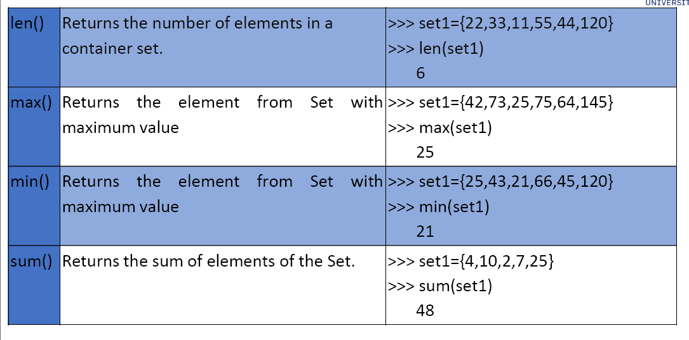
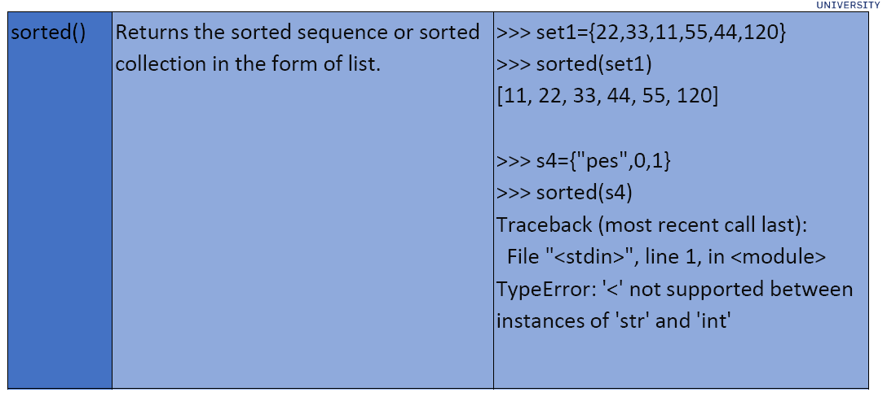

- What is a set in python? #card
  id:: 6a80a8ac-4d89-4864-8a10-7875ef17f378
	- A set is an unordered collection of Unique elements with zero or more elements present with the following attributes
- How to create sets in python? #card
  id:: 6a80a911-a1d6-4ec6-89f7-a6e50ee5be0a
	- In Python sets are written with curly braces. Constructor set() is used to create an empty set
	- ```python
	  Empty_set=set() # Use the constructor set().
	  • fruitset = { “apple”, “orange”, “kiwi”, “banana”, “cherry”}
	  • set1 = {(1, 'a', 'hi'), 2, 'hello', 5.56, 3+5j, True}
	  ```
- Are sets in python mutable? #card
  id:: 6a7da7a7-2fbd-4b1b-bdde-8cd1c35df6f9
	- Set is mutable - in the sense that the elements can be added or remove, but the elements within the set must be immutable or hashable
- Are sets in python ordered? #card
  id:: 6a82d8e1-bf86-4c01-91d1-738e56d4faad
	- Unordered – Order of elements in a set need not be same as the order in which we add or delete elements to/from the set.
- Are sets in python iterable? How to iterate over the elements in the set? #card
  id:: 6a82d8f6-10d8-4bb5-a455-65c8915f1281
	- Yes, they are Iterable – A container object capable of returning its members one at a time. Set is eager and not lazy.
	- ```python
	  s = { 10,20,30}
	  for item in s:
	    print(s)
	  ```
	-
- Can you access elements in a Python set using indexing? #card
  id:: 6a82d94b-99c4-4971-ad6f-b322234593f9
	- Not indexable - Cannot access items in a set by referring to an index, since sets are unordered in nature.
	  • Check for membership using the in operator is faster in case of a set compared to a list,
	  a tuple or a string.
-
- Name some typical uses of Python sets? #card
  id:: 6a7da7a7-9183-4087-8e42-1b7498516df6
	- Sets are used to :
	  o Remove the duplicate elements, inturn allowing us to find the unique elements.
	  o Compare two iterables for common elements or difference.
-
- # Characteristics of sets
- What kinds of elements can be added to a set in python? #card
  id:: 6a82d9c8-7987-4045-bc3d-fde9698da372
	- Elements are unique – does not support repeated elements.
	- Elements should be hashable. Hashing is a mechanism to convert the given element into an integer.
	- An object is hashable if it has a hash value which never changes during its lifetime (it needs a __hash__() method).
	  Examples of hashable objects:
	  • int, float, complex, bool, string, tuple, range, frozenset, bytes, decimal.
	  Examples of Unhashable objects:
	  • list, dict, set, bytearray
	- ```python
	  #set1={ [ 1, 'a', 'hi' ], 2, 'hello', {3, 4.5, 'how r u' } }
	  #TypeError: unhashable type: 'list’
	  #set2={ ( 1, 'a', 'hi' ), 2, 'hello', {1:'hi', 2:'hello', 3:'how r u'} }
	  #TypeError: unhashable type: 'dict’
	  Examples
	  set3={ ( 1, 'a', 'hi' ), 2, 'hello', 5.56, 3+5j, True }
	  print(set3)
	  #{True, (1, 'a', 'hi'), 2, 5.56, (3+5j), 'hello’}
	  my_dict = {'name': 'John', tuple([1,2,3]):'values’}
	  print(my_dict)
	  #{'name': 'John', (1, 2, 3): 'values'}
	  ```
- # common methods of sets
	- How do you get the number of elements in a set #card
	  id:: 6a82da31-b032-40e5-8e89-db985ae0a353
		- using the len(s) method
	- How do you compute the sum of elements in a set? #card
	  id:: 6a82da67-f36c-445e-af4d-377a8d87aa04
		- using the sum() method
	- How to use the sorted method on python set? #card
	  id:: 6a82dcea-3104-4ae1-a72e-b29ca0ce566d
		- sorted(s).
		- TODO Add more detailed example
	- How to maximum and minimum of the elements in a set? #card
	  id:: 6a82dbd9-11e4-45ad-b672-104715b8e1e0
		- max(s) and min(s)
	- How to determine all the properties and the methods defined a specified object? #card
	  id:: 6a82dc9e-40df-4edf-9efc-3fbf95309d51
		- The dir() function returns all properties and methods of the specified object.
			- ```python
			  >>> dir(set)
			  o ['__and__', '__class__', '__class_getitem__', '__contains__', '__delattr__',
			  '__dir__', '__doc__', '__eq__', '__format__', '__ge__', '__getattribute__',
			  '__getstate__', '__gt__', '__hash__', '__iand__', '__init__',
			  '__init_subclass__', '__ior__', '__isub__', '__iter__', '__ixor__', '__le__',
			  Specific methods of Set
			  PYTHON FOR COMPUTATIONAL PROBLEM SOLVING
			  '__len__', '__lt__', '__ne__', '__new__', '__or__', '__rand__', '__reduce__',
			  '__reduce_ex__', '__repr__', '__ror__', '__rsub__', '__rxor__', '__setattr__',
			  '__sizeof__', '__str__', '__sub__', '__subclasshook__', '__xor__', 'add',
			  'clear', 'copy', 'difference', 'difference_update', 'discard', 'intersection',
			  'intersection_update', 'isdisjoint', 'issubset', 'issuperset', 'pop', 'remove',
			  'symmetric_difference', 'symmetric_difference_update', 'union', 'update']
			  ```
- # Methods in detail
	- 
	- 
	-
	- How to concatenate elements in two set? #card
	  id:: 6a82dd38-a71b-4d6a-915c-97b1087db370
		- Concatenation (|=) operator can be used to combine two sets together, results
		  in a set that contains items of the two sets.
		- ```python
		  >>> s1={1,2.34,(34,22),"python"} >>> s2={10,3.22,"programming"}
		  >>> s1|=s2
		  >>> s1
		  {1, 2.34, 'python', (34, 22), 3.22, 'programming', 10}
		  ```
	- How to use the Repetition operator(*) on python sets? #card
	  id:: 6a7da7a7-ea05-4a90-8b3e-07744a868723
		- – Throws an error as set has unique elements.
		- ```python
		  >>> s1={1,2,3,4,5,6}
		  >>> print(s1*3)
		  Traceback (most recent call last):
		  File "<stdin>", line 1, in <module>
		  TypeError: unsupported operand type(s) for *: 'set' and 'int’
		  ```
- # Membership operator
	- How to check if an element is present in a set? #card
	  id:: 6a82dded-f34f-47b8-8bf4-860fdf7ddfb6
		- Membership operator(in) – returns True if a sequence with the specified value is present in the set otherwise False.
		- ```python
		  >>> s1={1,2,3,4,5,6}
		  >>> print(1 in s1)
		  True
		  >>> print('a' in s1)
		  False
		  ```
- # union
- How to compute the union of sets in python? #card
  id:: 6a7da7a7-23e2-409e-9b26-68ab527b9e9e
	- union()- Return the union of sets as a new set. (i.e. all elements that are in either set.) .
	- ```python
	  >>> s1={1,2,3,4,5,6}
	  >>> s2={6,5,7,8,9,10}
	  >>> print(s1.union(s2)) 
	  {1, 2, 3, 4, 5, 6, 7, 8, 9, 10} 
	  >>> print(s1|s2)
	  {1, 2, 3, 4, 5, 6, 7, 8, 9, 10}
	  ```
- # Intersection
- How to compute the intersection of two sets in python? #card
  id:: 6a7da7a7-5251-4a4e-9cd9-d50a3eb0cddc
	- intersection()- Return the intersection of sets as a new set. (i.e. all elements that are in both sets.) .
	- ```python
	  >>> s1={1,2,3,4,5,6}
	  >>> s2={6,5,7,8,9,10}
	  >>> print(s1.intersection(s2))
	  {5, 6}
	  
	  or
	  >>> print(s1&s2)
	  {5, 6}
	  
	  ```
- # difference
- How is the difference between two sets defined? How to compute the difference in python? #card
  id:: 6a82def3-83be-451e-90f2-4e13eaf3add4
	- difference()- Return the difference of two or more sets as a new set.
	- ```python
	  >>> s1={1,2,3,4,5,6}
	  >>> s2={6,5,7,8,9,10}
	  >>> print(s1.difference(s2))
	  {1, 2, 3, 4}
	  >>> print(s1-s2)
	   {1, 2, 3, 4}
	  ```
- # add
- How to add an element to a set in python? #card
  id:: 6a7da7a7-fa73-4c74-b7c0-ee6fb3fa16c2
	- adds an element in a container set.
	- ```python
	  s1 = {1,2,3,4}
	  s1.add(7)
	  
	  ```
- # symmetric difference
- What is symmetric difference of two sets and how to compute them in python? #card
  id:: 6a82e069-481e-439c-899a-bb8ee9351aef
	-
	- The **symmetric difference** of two sets is the set of elements that belong to **either of the sets, but not to both** at the same time. [[1](https://lexique.netmath.ca/en/symmetric-difference-of-sets/), [2](https://www.vedantu.com/question-answer/let-the-sets-a-and-b-be-aleft-123456-rightbleft-class-11-maths-cbse-5f71d02ddc480e2a5c0269b9), [3](https://testbook.com/maths/set-difference)]
	- In other words, it contains all elements that are unique to each set, completely excluding their intersection. Mathematically, for two sets \(A\) and \(B\), it is denoted as \(A \Delta B\) or \(A \ominus B\), and calculated as \((A \cup B) - (A \cap B)\) or \((A - B) \cup (B - A)\).
	- Python provides two ways to find the symmetric difference: the **`^` operator** or the **`.symmetric_difference()` method**.
		- Using the `^` Operator
		- This operator only works when comparing a set against another actual `set` object
		- ```python
		  python# Define two sets
		  set_a = {1, 2, 3, 4}
		  set_b = {3, 4, 5, 6}
		  
		  # Calculate symmetric difference
		  result = set_a ^ set_b
		  
		  print(result)  
		  # Output: {1, 2, 5, 6}
		  ```
		-
		- Using the .symmetric_difference method. This method is more flexible because the argument can be any iterable (like a list, tuple, or dictionary), not just a set
		- ```python
		  # Define a set and a list
		  set_a = {"apple", "banana", "cherry"}
		  list_b = ["banana", "cherry", "date"]
		  
		  # Calculate symmetric difference
		  result = set_a.symmetric_difference(list_b)
		  
		  print(result)  
		  # Output: {'apple', 'date'}
		  ```
- # remove
- How to remove an item in a set? #card
  id:: 6a7da7a7-69c3-40f2-b7f8-07ed6459e868
	- `s.remove(elem)`
	- Removes the specified item in a set. If the item to remove does not exist, remove() will raise an error.
-
- # discard
- What does the discard method on set do on python? How is it different from the remove method? #card
  id:: 6a7da7a7-159d-4899-9b60-0bd2f817d9ef
	- Removes the specified item in a set. If the item to remove does not exist, discard() will NOT raise an error.
	- ```python
	  s1.discard(7)
	  ```
- # pop
- How to pop an element from a set? How can you know which element will be popped? #card
  id:: 6a82e1c7-b4db-4ccc-85a2-66449811040b
	- Removes an item in a set. Sets are unordered, so when using the pop() method, doesn’t know which item that gets removed.
	- ```python
	  s1.pop()
	  ```
- # update
- How to add elements from any other iterable to a set? #card
  id:: 6a82e1fc-df86-435b-be0c-5820195d5b75
	- update()- updates the current set, by adding items from another set (or any other iterable). If the element is present in both the sets, only one appearance of element present in updated set
	- ```python
	  >>> s1={120,12,23}
	  >>> s1.update([22,15,67,"pes"])
	  >>> s1
	  
	  
	  {67, 12, 15, 22, 23, 120, 'pes’}
	  ```
- # intersection update
- What does the intersection_update method on python do? #card
  id:: 6a82e3a7-2633-4ef1-b8c8-6fce4b335db2
	- intersection_update()- Removes the items that is not present in both sets.
	- ```pyhon
	  >>> set1={"apple", "banana", "cherry"}
	  >>> set2={"google", "microsoft", "apple"}
	  >>> set1.intersection_update(set2)
	  >>> set1
	  {'apple'}
	  ```
- # difference_update
- What does the difference_update method on python do? #card
  id:: 6a7da7a7-19c2-44ff-ab50-d11c9e75126f
	- Updates the original set by removing items that are present in both sets, and inserting the other items.
	- ```python
	  >>> set1={"apple", "banana", "cherry"}
	  >>> set2={"google", "microsoft", "apple"}
	  >>> set1.symmetric_difference_update(set2)
	  >>> set1
	  {'microsoft', 'google', 'banana', 'cherry'}
	  ```
- # issubset
- How to check if one set is a subset of the other? #card
  id:: 6a82e408-273b-45cb-b8db-c12a2b6592c1
	- Returns True if all items in set ‘x’ are present in set ‘y’.
	- ```python
	  >>> x = {"a", "b", "c"}
	  >>> y = {"f", "e", "d", "c", "b", "a"}
	  >>> x.issubset(y)
	  True
	  >>> y.issubset(x)
	  False
	  ```
- # issuperset
- How to check if one set is a superset of the other? #card
  id:: 6a7da7a7-9b86-4e2a-9a3a-48c2eff3a2ab
	- Returns True if all items in set ‘y’ are present in set ‘x’.
	- ```python
	  >>> x = {"f", "e", "d", "c", "b", "a"}
	  >>> y = {"a", "b", "c"}
	  >>> x.issuperset(y)
	  True
	  >>> y.issuperset(x)
	  False
	  ```
- # isdisjoint
- What are disjoint sets? How to compute them in python? #card
  id:: 6a82e45d-7277-4bf3-a355-49be71e95df1
	- **Disjoint sets** are two or more sets that have **no elements in common**
	- ```python
	  >>> s1={1,2,5}
	  >>> s2={11,22,55}
	  >>> s1.isdisjoint(s2)
	  True
	  ```
- # clear
- How to clear all the elements in a set? #card
  id:: 6a7da7a7-d9c7-4b0c-983e-61c391b4ac91
	- clear()- Removes all the elements in a set.
	- ```python
	  >>> x = {"f", "e", "d", "c", "b", "a"}
	  >>> x.clear()
	  >>> x
	  set()
	  ```
- # Example
- How to check if a set is empty? #card
  id:: 6a82e499-fa7b-49ec-8a3f-9b61f3ac48c1
	- option 1: check if the len(s1) == 0 where s1i is a set
	- option2: since empty data structure is False; below can be writte
	- ```python
	  s1 = set()
	  if(s1):
	    print("Set is empty")
	  else:
	    print("not empty")
	    
	  ```